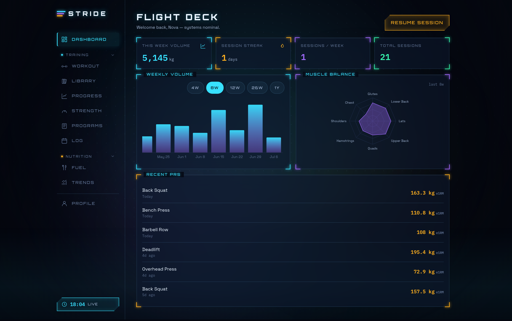
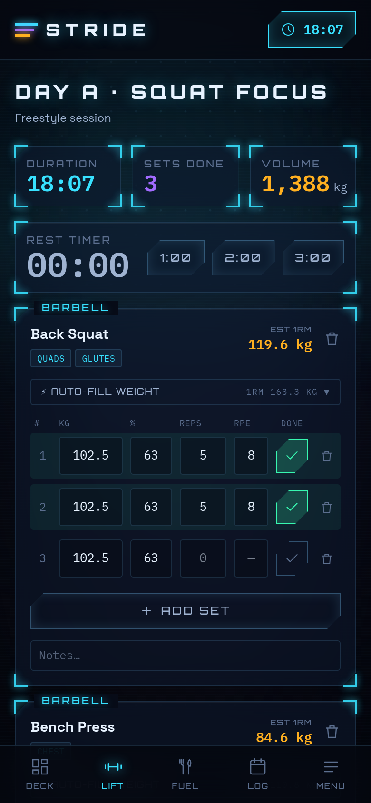
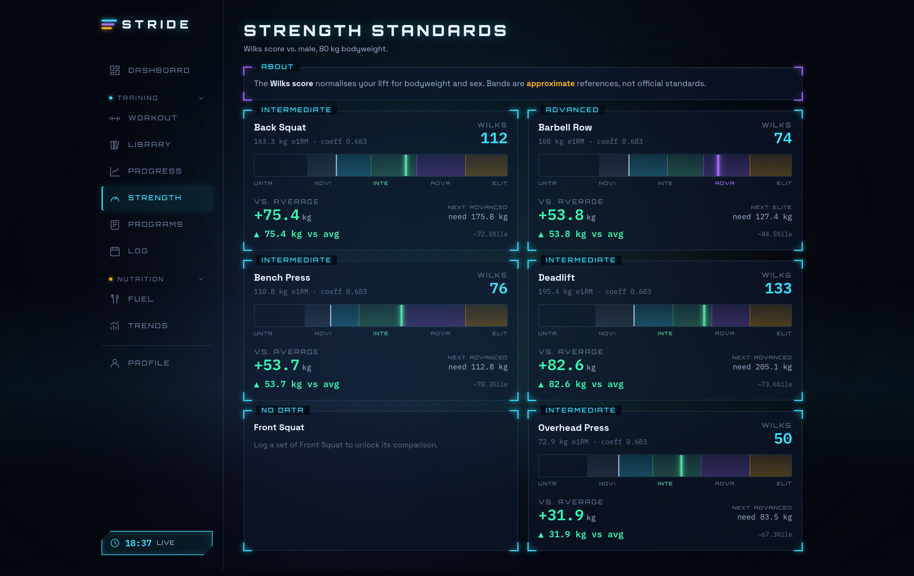
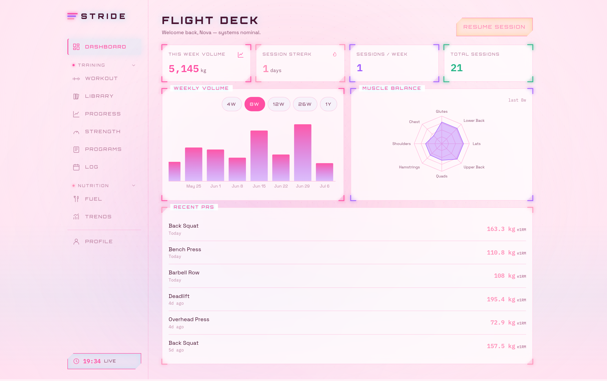
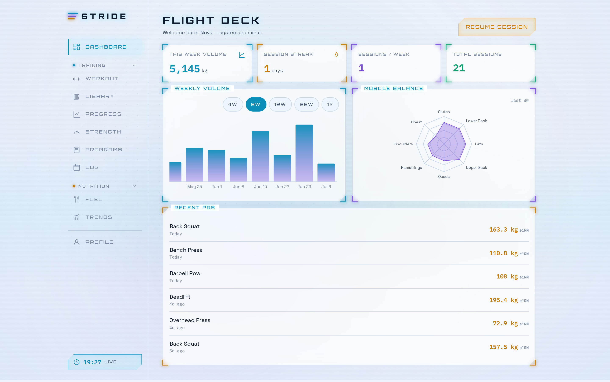

# STRIDE — Holographic Strength-Tracking PWA

**STRIDE** is an offline-first Progressive Web App for tracking workouts and
strength progression over time. It blends **structured program following**
(Boostcamp-style) with **adaptive auto-regulation** (LiftOff-style), and adds a
distinctive differentiator: **bodyweight-relative strength comparison** that
places each of your lifts against published strength-standard bands for your
sex and bodyweight.

By default everything runs **100% client-side** in your browser (IndexedDB via
Dexie) — no account or network required. **Optional Supabase cloud sync** adds
accounts and multi-device sync while keeping the app fully offline-first.

The interface is a dark **"Starship HUD"**: frosted-glass chamfered panels with
glowing corner brackets, a drifting cyan/violet aurora over a dotted-grid
space-navy field, luminous scanlines, and instrument-panel numeric readouts.



---

## Feature Tour

| Area | What it does |
| --- | --- |
| **Flight Deck (Dashboard)** | Weekly volume, session streak, muscle-group balance radar, recent estimated-1RM PRs. Start/resume a session. |
| **Workout Logging** | Freestyle or program-driven sessions. Log weight / reps / RPE / notes per set, mark sets complete. Per-set **rest timer** (auto-starts on completion) + a running **workout duration timer**; both survive backgrounding via persisted timestamps. Editable, deletable sets. **Auto-fill weight** from your 1RM by **%1RM** or **RPE + reps**. |
| **Planner** | Build a workout **before** you train — exercises, sets, target reps & weight — right on the Workout tab. **Save** plans by name, **edit/reorder/delete** them, and **launch** one any day: sets are pre-created with weights filled and target reps as placeholders. Plans sync with Cloud Sync. |
| **Exercise Library** | 162 preloaded exercises with muscle groups, equipment, movement pattern, and category. Search + filter by muscle/equipment. Add custom exercises. **Set a 1RM PR per lift** — used to auto-fill working weights. |
| **Progress** | Per-exercise charts: estimated 1RM over time (Epley or Brzycki), top set, session volume, and a PR timeline. **Settable period** (3M/6M/1Y/All); the dashboard volume chart has a 4w–1y window. |
| **Strength Standards** | The differentiator — see below. |
| **Programs** | Import multi-week programs (file upload or paste-JSON, Zod-validated), follow week/day with adaptive load suggestions, export any program back to JSON. Ships 3 example programs. |
| **Activity Log** | Browse every finished session (date, duration, volume, sets, lifts) and expand any one for full per-exercise set detail. A month **calendar** shows training days (cyan) *and* days with meals logged (violet dot); tap a day to see that day's sessions **and** its meal breakdown, with a one-tap jump into Fuel. |
| **Fuel (Nutrition)** | MyFitnessPal-style daily food journal divided into meals, with calorie + protein/carb/fat bars against your targets. **Auto-calculated goals** (Mifflin-St Jeor from weight/height/age/sex, training frequency, and cut/maintain/bulk rate) or manual targets. Log food by **searching the Open Food Facts catalogue** (millions of products), **scanning a barcode** (native BarcodeDetector with a lazy-loaded ZXing fallback), re-logging from **My Foods**, or creating custom foods. Amounts are **servings × serving size** (labelled serving, 100 g, exact grams, or oz), MyFitnessPal-style. Journal + My Foods back up via Cloud Sync. |
| **Nutrition Trends** | Derived metrics over a **settable period** (1W/2W/1M/3M/All): average kcal / protein / carbs / fat per logged day vs your targets, plus daily calorie and protein charts with target reference lines. Averages skip unlogged days. |
| **Profile** | Sex, bodyweight, height, age, kg/lb units (toggles everywhere), default rest time, data export/erase, and a "Load Sample Data" button. **Theme picker**: Starship HUD (default), Dark Night, Light, and Bubblegum. |

Navigation is an **expandable side menu**: collapsible TRAINING / NUTRITION
groups on the desktop rail, and on mobile a slim bottom bar (Deck · Lift ·
Fuel · Log) plus a Menu tab that opens the full slide-in menu.

### Screenshots

Mobile (390×844) and desktop (1440×900) captures of every screen live in
[`artifacts/screenshots/`](artifacts/screenshots/), regenerated by the
Playwright loop (`pnpm shots`).

| Workout logging | Strength standards |
| --- | --- |
|  |  |

Themes (Bubblegum / Light / Dark Night):

| Bubblegum | Light |
| --- | --- |
|  |  |

---

## Bodyweight-Relative Strength Comparison

For each big lift (Back Squat, Bench Press, Deadlift, Overhead Press, Barbell
Row, Front Squat), STRIDE takes your **best estimated 1RM**, divides by your
**bodyweight**, and places the resulting ratio on a labelled band scale:

`Untrained → Novice → Intermediate → Advanced → Elite`

It computes your **Wilks score** (the lift normalised for bodyweight and sex),
shows your training level, an **approximate percentile**, and your **delta vs.
the average reference** (green up / red down).

**Honesty matters here.** The Wilks coefficient is the published formula; the
per-lift level bands are **approximate** references derived by running openly
published ratio standards (ExRx.net / Symmetric Strength) through Wilks — not
official standards, and percentiles are approximate. Full details are in
[`DECISIONS.md` §3](DECISIONS.md). Nothing is presented as authoritative.

---

## Program Import Format

Programs are validated with [Zod](https://zod.dev) (`src/schema/program.ts`).
Import via **file upload** or **paste-JSON** on the Programs screen; export any
stored program back to JSON. Minimal example:

```json
{
  "schemaVersion": 1,
  "name": "Novice Linear Progression",
  "units": "kg",
  "weeks": [
    {
      "name": "Week 1",
      "days": [
        {
          "name": "Day A",
          "exercises": [
            {
              "exerciseName": "Back Squat",
              "sets": 3,
              "reps": 5,
              "intensity": { "type": "rpe", "value": 8 },
              "progression": { "type": "linear", "incrementKg": 2.5, "onSuccessRepTarget": 5 }
            }
          ]
        }
      ]
    }
  ]
}
```

- **`reps`** — a number (`5`) or an inclusive range (`[8, 12]`).
- **`intensity`** — `{ "type": "absolute", "value": 100 }` (in `units`),
  `{ "type": "percent1rm", "value": 80 }`, or `{ "type": "rpe", "value": 8 }`.
- **`progression`** (optional auto-regulation) —
  `{ "type": "linear", "incrementKg": 2.5, "onSuccessRepTarget": 5 }`,
  `{ "type": "double", "repRange": [6, 10], "incrementKg": 2.5 }`, or
  `{ "type": "percent-e1rm", "percent": 90 }`.

See [`DECISIONS.md` §4](DECISIONS.md) for the full schema and semantics.

---

## Cloud Sync (optional, Supabase)

STRIDE is **offline-first**: IndexedDB is always the source of truth and the app
works with no backend. When you configure Supabase and sign in, your **workouts,
programs, custom exercises, food journal + My Foods, and profile** sync across
devices in the background.

- **Architecture** — local-first with background sync. On sign-in, local and
  remote data are reconciled **last-write-wins** using per-record `updatedAt`
  timestamps; deletions propagate via tombstones. Supabase **Realtime** pushes
  changes to other signed-in devices live. If you're offline, everything keeps
  working and syncs when you reconnect.
- **Auth** — email/password and passwordless magic-link (Supabase Auth).
- **Isolation** — Postgres **Row Level Security** scopes every row to its owner
  (`user_id = auth.uid()`), so users only ever see their own data.

### Enable it

1. Create a Supabase project. Copy the **Project URL** and the **anon /
   publishable key** (safe to expose in a browser).
2. Run [`supabase/schema.sql`](supabase/schema.sql) once in the Supabase SQL
   Editor (creates the tables, RLS policies, and Realtime publication). The
   script is idempotent — re-run it after updating STRIDE to pick up new
   tables (e.g. the Fuel journal's `food_logs` / `foods`).
3. Set env vars (local `.env`, or repo secrets for the Pages deploy):
   ```bash
   VITE_SUPABASE_URL=https://<project>.supabase.co
   VITE_SUPABASE_ANON_KEY=<anon-or-publishable-key>
   ```
4. Run the app, open **Profile → Cloud Sync**, and sign in.

If the env vars are unset the app simply runs local-only. If you sign in before
running the schema, the Cloud Sync panel tells you the tables are missing.

**Limitations**: last-write-wins resolves conflicts at the record (whole
workout/program) level, not field-by-field; the seeded exercise library is
identical for everyone and isn't synced (only your custom exercises are).

## Deployment (GitHub Pages)

A workflow at [`.github/workflows/deploy.yml`](.github/workflows/deploy.yml)
builds and publishes the app to GitHub Pages on every push to `main`.

1. In the repo, go to **Settings → Pages → Build and deployment → Source** and
   choose **GitHub Actions**.
2. (Optional, for cloud sync on the live site) add repository **secrets**
   `VITE_SUPABASE_URL` and `VITE_SUPABASE_ANON_KEY` under
   **Settings → Secrets and variables → Actions**.
3. Push to `main` (or run the workflow manually). The site publishes at
   `https://<owner>.github.io/<repo>/`.

The build sets Vite's `base` to `/<repo>/` automatically (via `VITE_BASE`), and
the app uses hash-based routing so deep links work on Pages without server
rewrites. The PWA manifest scope/start_url follow the base path.

## Getting Started

Requires **Node ≥ 20** and **pnpm**.

```bash
pnpm install        # install dependencies
pnpm dev            # start the dev server (http://localhost:5173)
pnpm build          # type-check (strict) + production build to dist/
pnpm preview        # preview the production build (installable PWA + offline)
```

Quality gates:

```bash
pnpm lint           # ESLint (zero warnings)
pnpm test           # Vitest unit tests (e1RM, progression, standards, import, analytics, units)
pnpm e2e            # Playwright smoke tests (boots its own dev server)
pnpm shots          # regenerate screenshots into artifacts/screenshots/
```

### Installing as a PWA / using offline

1. `pnpm build && pnpm preview`, open the served URL.
2. Use the browser's **Install** action (address-bar icon on desktop, "Add to
   Home Screen" on mobile).
3. After the first load, disconnect from the network — the app shell, fonts,
   seeded data, and all screens continue to work. Data persists locally in
   IndexedDB.

Fonts (Orbitron, IBM Plex Mono, Space Grotesk) are **self-hosted** in
`public/fonts/` and precached by the service worker, so typography renders
offline.

---

## Tech Stack

React 19 · TypeScript (strict) · Vite 8 · Tailwind CSS v4 · vite-plugin-pwa
(Workbox) · Dexie (IndexedDB) · Zustand · Recharts · Zod · Supabase (optional
cloud sync) · Vitest · Playwright · GitHub Actions (Pages deploy).

Rationale for each choice, the strength-standards source, and the schema docs
are in [`DECISIONS.md`](DECISIONS.md).

## Project Structure

```
src/
  components/hud/   Reusable HUD primitives: HudPanel, CornerBrackets, Readout,
                    HudButton, BandScale, Scanlines, AuroraBg, Modal, controls
  components/fuel/  Nutrition UI: add-food flow, barcode scanner, quantity
                    editor, goal calculator, entry editor
  data/             162-exercise seed library, muscle taxonomy, strength standards
  db/               Dexie schema, types, first-run seeding
  fixtures/         3 example importable programs
  hooks/            Live queries (dexie-react-hooks), ticking clock
  lib/              units, e1RM, progression engine, analytics, program runner,
                    nutrition math (BMR/TDEE/macros), Open Food Facts client
  routes/           Dashboard, Workout, Library, Progress, Strength, Programs,
                    History, Fuel, Profile
  schema/           Zod program schema + validation
  store/            Zustand stores (app state + auth/sync)
  sync/             Supabase sync engine, last-write-wins merge, local helpers
  lib/supabase.ts   env-gated Supabase client (null when unconfigured)
tests/              Playwright smoke tests
supabase/           schema.sql (tables, RLS policies, Realtime)
.github/workflows/  GitHub Pages deploy
scripts/            icon + screenshot generators
```

## Guardrails & Limitations

- **Local-first**: no secrets; your data never leaves the device. The only
  external runtime call is the optional Open Food Facts lookup when you search
  or scan a food on the Fuel page — logged foods are snapshotted locally, so
  the journal itself works fully offline.
- The strength comparison is a **ratio model of approximate reference bands**,
  not authoritative or medical guidance — see `DECISIONS.md`.
- Estimated 1RM formulas lose accuracy above ~12 reps (flagged in-app).
- Macro targets use the published Mifflin-St Jeor equation and standard
  activity multipliers — planning estimates, not medical advice.
